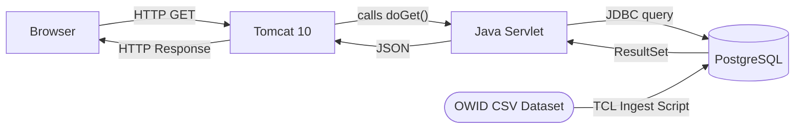

# Global Energy Dashboard
A full-stack web application that visualizes global electricity generation across 10 countries from 1985-2024, using Java, Tomcat, PostgreSQL, and TCL on an Ubuntu Virtual Machine.

A **Line Chart** tracks how a country's energy mix has shifted over 40 years  
A **Bar Chart** compares all 10 countries side-by-side for any energy type and year

A TCL ingestion script downloads 23,000+ rows from [Our World in Data](https://github.com/owid/energy-data/) into PostgreSQL. Two Java servlets running on Apache Tomcat 10 expose a JSON API that a JavaScript frontend queries to render live Chart.js visualizations all running on Ubuntu 24.04.

## Tech Stack
| Layer | Technology |
|---|---|
| Frontend | HTML5, CSS, JavaScript, Chart.js |
| Web Server | Apache Tomcat 10.1.16 |
| Backend | Java 17.0.18 (Jakarta Servlet API) |
| Database | PostgreSQL 16.13 |
| Database Driver | PostgreSQL JDBC |
| Data Ingestion | TCL 8.6 (TDBC) |
| OS | Ubuntu 24.04 (Hyper-V VM) |

## Architecture
The frontend makes HTTP requests to two Java servlets running on Tomcat. The servlets query PostgreSQL using JDBC and return a JSON. The database was populated by a TCL script that downloaded 23,000+ rows from the OWID energy dataset.

## Design Pattern - MVC
This project follows the **Model-View-Controller** pattern:
| Layer | Role | In This Project |
|---|---|---|
| **Model** | Holds the data | PostgreSQL database (`owid_energy` table) |
| **View** | What the user sees | `index.html` - Chart.js visualizations |
| **Controller** | Handles requests, talks to the model | `EnergyServlet.java`, `CompareServlet.java` |

The servlets act as the controllers since they receive HTTP requests from the frontend, query the database, and return JSON. Each layer has one job: index.html just for displaying json, servlets for getting data and giving json to 'view', and Postgres just in charge of requests of querying data when servlet requests it.

## Future Improvements
- **Automated Data Refresh**: I could add a cron job on Ubuntu that re-runs ingest.tcl once per year to pull the latest OWID data set automatically.
- **Additional Datasets**: It would be interesting to see the relationship of a country's nuclear energy production to their exchange rate (see if there is any relationship there).
- **Cloud Deployment**: I was thinking of using Oracle Cloud Free Tier for a permanent public URL (better for sharing and more tangible).
---
## API Endpoints

### `Get /energyapi/energy`
 
Returns a country's full energy history ordered by year.
 
| Parameter | Type | Default | Description |
|---|---|---|---|
| `country` | string | `Canada` | Country name |
 
**Example request:**
 
    GET /energyapi/energy?country=Japan
 
**Example response:**
 
    [
      {"year": 2011, "renewables": 107.48, "fossil": 898.06, "nuclear": 156.18},
      {"year": 2012, "renewables": 120.54, "fossil": 963.87, "nuclear": 17.24}
    ]

---
 
### `GET /energyapi/compare`
 
Returns a single energy type's value for all 10 countries in a given year.
 
| Parameter | Type | Default | Description |
|---|---|---|---|
| `type` | string | `nuclear` | `nuclear`, `renewables`, or `fossil` |
| `year` | string | `2023` | Four digit year |
 
**Example request:**
 
    GET /energyapi/compare?type=nuclear&year=2023
 
**Example response:**
 
    [
      {"country": "United States", "value": 774.87},
      {"country": "France", "value": 338.20},
      {"country": "China", "value": 434.72}
    ]