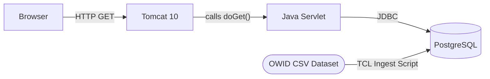

# Global Energy Dashboard
A full-stack web application that visualizes global electricity generation across 10 countries from 1985-2024, using Java, Tomcat, PostgreSQL, and TCL on an Ubuntu Virtual Machine.

A **Line Chart** tracks how a country's energy mix has shifted over 40 years  
A **Bar Chart** compares all 10 countries side-by-side for any energy type and year

A TCL ingestion script downloads 23,000+ rows from [Our World in Data](https://github.com/owid/energy-data/) into PostgreSQL. Two Java servlets running on Apache Tomcat 10 expose a JSON API that a JavaScript frontend queries to render live Chart.js visualizations all running on Ubuntu 24.04.

## Tech Stack
| Layer | Technology |
|---|---|
| Frontend | HTML5, CSS, JavaScript, Chart.js |
| Web Server | Apache Tomcat 10.1.16 |
| Backend | Java 17.0.18 (Jakarta Servlet API) |
| Database | PostgreSQL 16.13 |
| Database Driver | PostgreSQL JDBC |
| Data Ingestion | TCL 8.6 (TDBC) |
| OS | Ubuntu 24.04 (Hyper-V VM) |

## Architecture
The frontend makes HTTP requests to two Java servlets running on Tomcat. The servlets query PostgreSQL using JDBC and return a JSON. The database was populated by a TCL script that downloaded 23,000+ rows from the OWID energy dataset.
